# ANALYSIS PATTERN- 2 (API TO COLLECT DATA AND STORE + 3 ANALYSIS)

# PROBLEM STATEMENT

To collect and store data through API and perform any 3 analysis on any dataset.
I have taken Boston Crime Datasets from a government website- https://data.cityofboston.gov/ and perform three analysis on the them. In order to support further arugument in analysis, I have added a new dataset hosted on the same website.

# DATA PROCESSING

# Data calling:

Boston data.cityofboston.gov/ website through Socrata, facilitates open data API for developer to gather the data. Getting data through API has less throttling compared to directly access the data for a particular ip address.

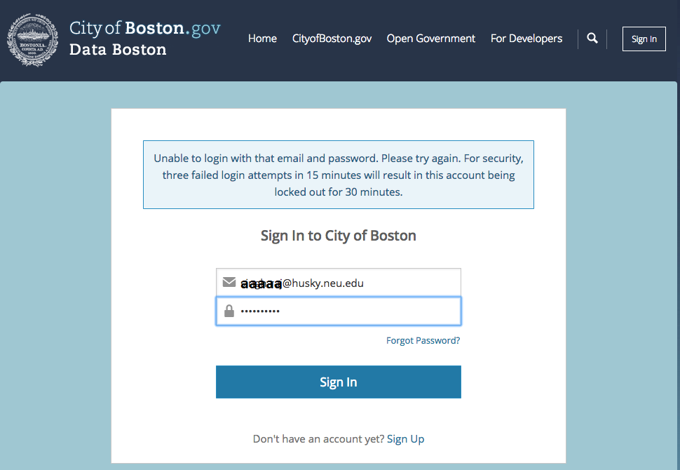
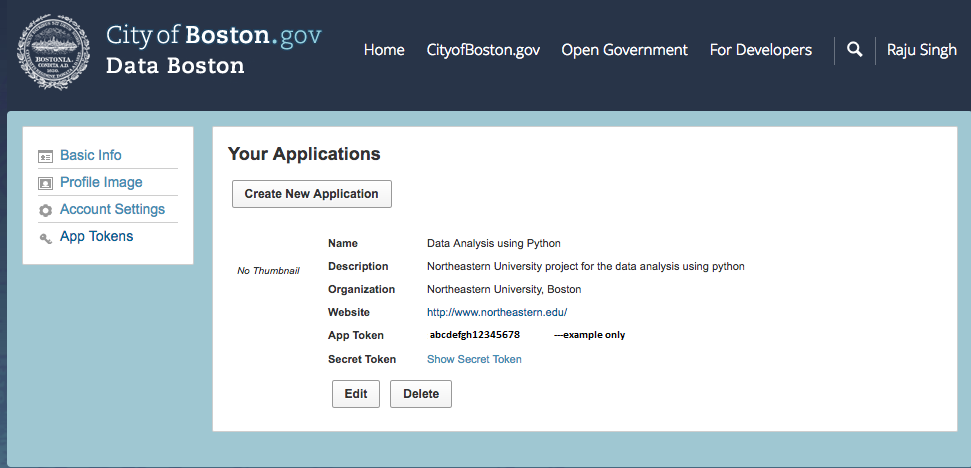

All datasets have a unique identifier - eight alphanumeric characters split into two four-character phrases by a dash.

For example, ufcx-3fdn is the identifier for the Boston crime data 2012 to 2015 (Legacy format).

For gatherdata I have stored API key as environment variable using below command in the Terminal:
$ export BOSTON_API_KEY=xyzabcxyzabc111 (example only)

All files collected, through API, from the host are in json format appended with datetime as prefix to avoid replacing of the collected data. 

# Data Storage:

There were two crime database one from 2012 to 2015 (Legacy) and another one from 2015 to 2017.
The way Boston government store crime data in former is different from the Legacy ones.
Two Database columns' header and data were slightly different. I've renamed the columns header of both and named them as same and merge two database together based on common columns name.

However, while calling data for analysis, I need to put 'or' condition inorder to get data from both legacy and latest merged database in which values are stored slight differently.

All raw data filea are stored in 'data' folder.

Further, for the analysis I have dumped all json files into a consolidated csv file. The consolidated csv files were put inside a  processedData which is inside 'data' folder only.

For all the analysis I have used the processed data only inorder to intact the json file as it and in any case of any eventuality I would be able to restored with the original raw data.

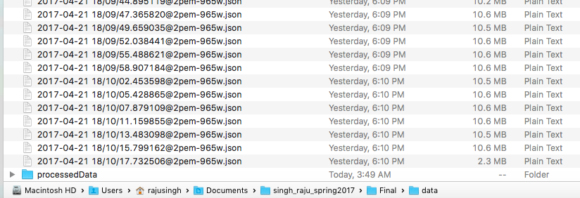

# ANALYSIS OF BOSTON CRIME

# BRIEF INTRODUCTION OF ANALYSIS-

# Objective of Analysis:

I have around six years of Boston crime records. I want to analyze the crime pattern of Boston over the six year and how crimes go change over the different neighborhood (Districts) of Boston.

# What are those Analysis:

1. Crime over year besides over week- what crime and why it cause.
2. Crime over the different neighborhood (Districts) of Boston
3. Police Patrolling/Stops and Crime Analysis in Boston

# Conclusion of the Analysis:

Post Analysis we deduce the information that what and why certain crimes takes place on a particule day of a neighborhood (District) of Boston. Also, plottings have been done on Boston map to illustrate lucid pattern over different Boston's districts.  

# DETAILS OF THE ANALYSIS PERFORMED-

# Analysis 1: Crime over year besides over week- what crime and why it cause

1. Analysing the number of crime indicents in Boston over the years.
2. Through pandas read csv function, access the processed data where merged crime database was placed.
3. Since, the database has data from Aug 2012 till Apr 2017, I have filtered out the year 2012 and 2017 from this analysis.
4. Thus, perfomed the anlysis on the crime incidents for year 2013 till 2016.
5. Done groupby over the year and count the crime incidents:

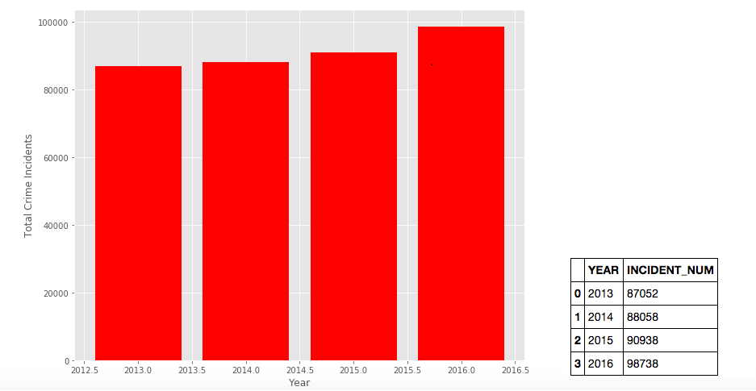

6. From above plot we can duduce that there is only subtle rise in crime over the years:

7. I take further dig into the data and check for which week the crime happened mostly:
8. I performed groupby function over the days of the week.
9. Ploted the crime against week

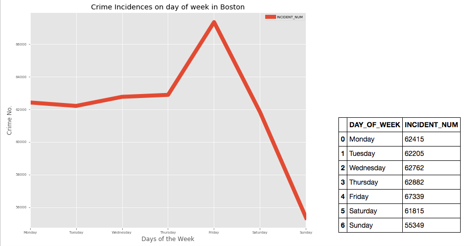

10. From above plot we can conclude that Most crime reported on the Friday
11. Also, reason could be anything related with partying- intoxication and resulted behavior like vandalism but we cannot deduce the direct conclusion on this.

12. I now need to do further analysis to check the charges impressed upon the convict by police dept.
13. I checked the number of crime associated with drug, drink charges on the day of the week.
Note: A person can be charged with multiple complaints.
14. Filtered out the crime charge with drugs, drinks and realted likely event like vandalism.
15. Ploted the crime drugs/drinks/vandalism against days of the week.

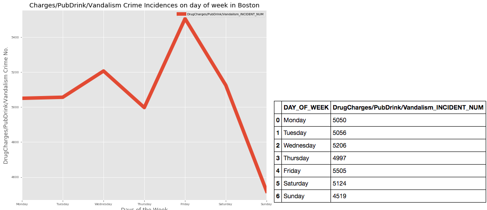

16 We can conclude from above plot that Drugs/drinks/vandalism related crime happened spike up on Friday.

# Overall Conclusion:
Crime incident in Boston over the year is subtle and when analyze crime incident by days, Friday comes out of the most voilent day of the week and reason could be drug/drinks and related crime action like vandalism which make up most of the crime number compared to other days of the week.  

# Analysis 2: Crime over the different neighborhood (Districts) of Boston

1. Analysing the number of crime indicents in Boston neighborhood over the years.
2. Through pandas read csv function, access the processed data where merged crime database was placed.
3. I plotted the total crime incident of the Boston map using the Basemap libary (a extension of matplotlib- please refer Additional Instruction).
4. To plot the crime incidents over the Boston map I have had to find the central latitude and longitude of Boston.
5. Further, basemap has all the coordinates of the earth. So, in order to zoom in the area of interest i.e. Boston region I have to give upperright and lowerleft longitude and latitude condinates in basemap function.
6. It zoom-in the Boston region and there I plot all crime reported accross Boston

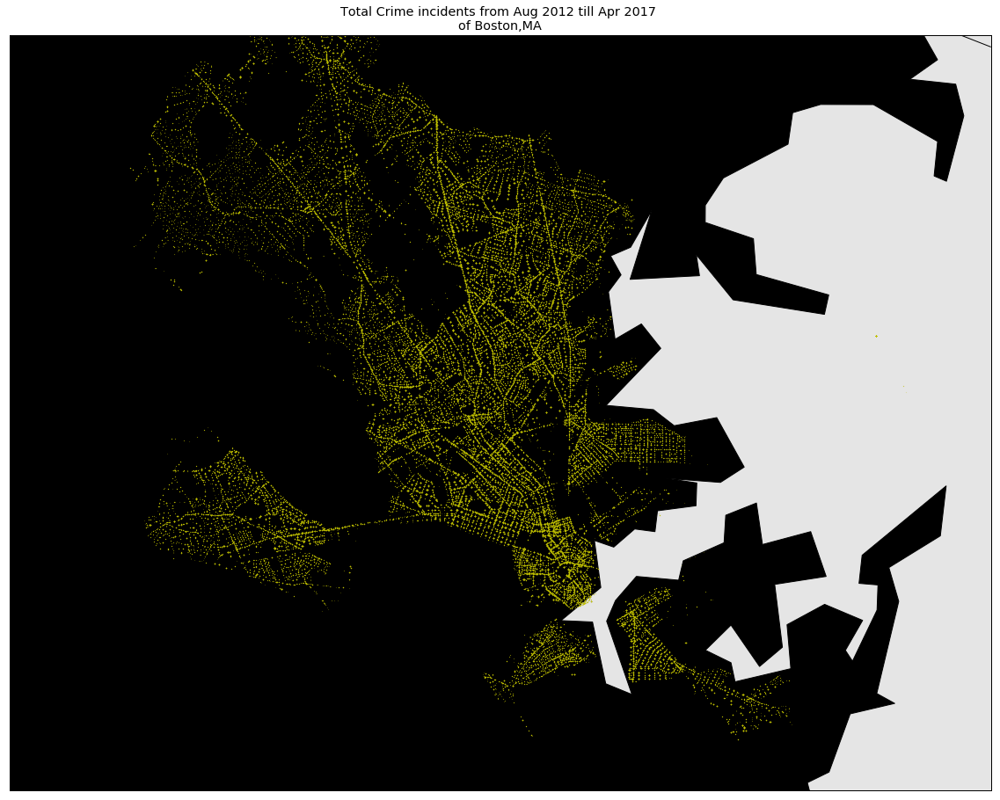

7. We can see from above that map the crime spread all over but more concentrated in central part of Boston.
8. However, to find which district is more affected, I have plotted the crime incidents by districts and find out the top five crime affected district

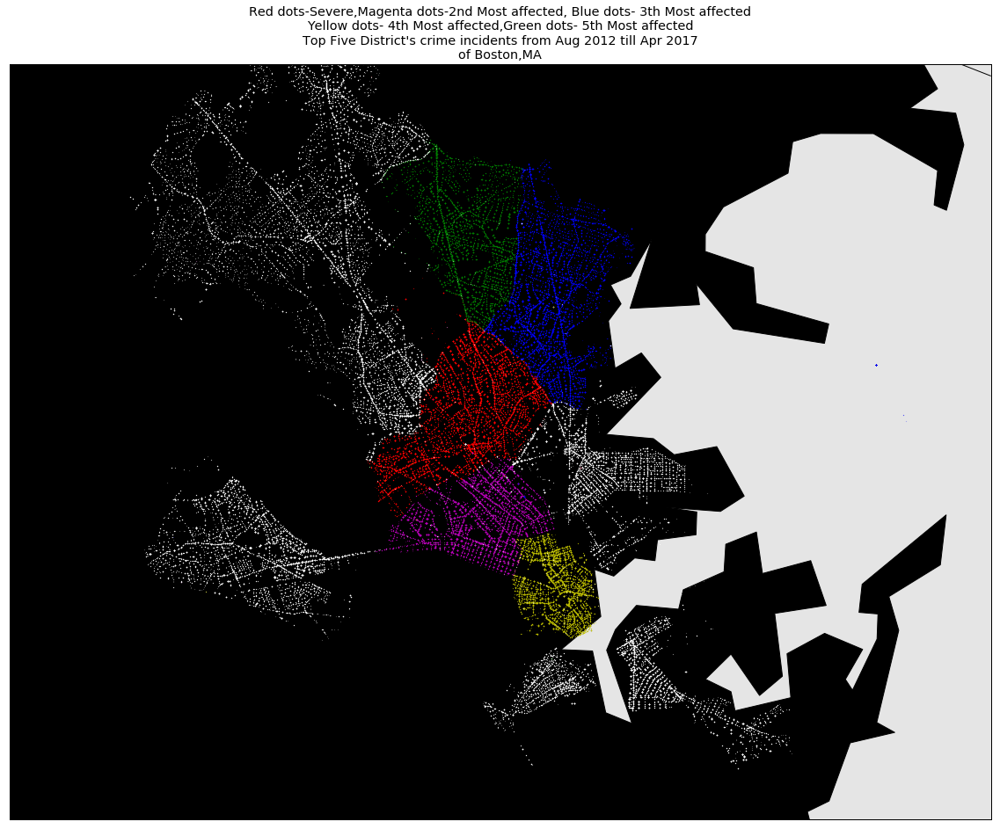

Histogram plot of crime number of all District of Boston.

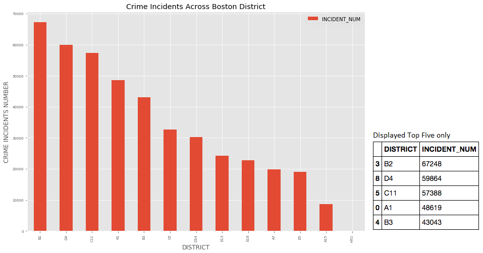

9. I also, analyse Aggraveted Assualt, Homicide/Murder on the Boston map.
(Definition:
Homicide is the killing of one person by another. Murder is a form of criminal homicide, where the perpetrator intended to kill the other person, sometimes with premeditation (a plan to kill).)

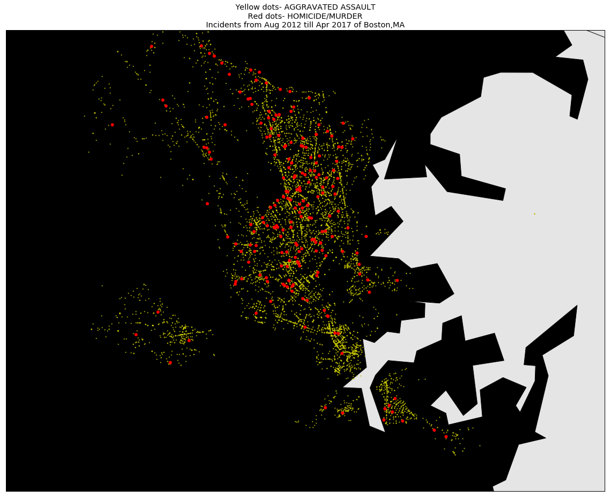

10. I wanted to check if Aggraveted Assualt resulted in Homicide or vice-versa. Thus, I try to plot Aggravted Assualt against the Homicide/Murder.

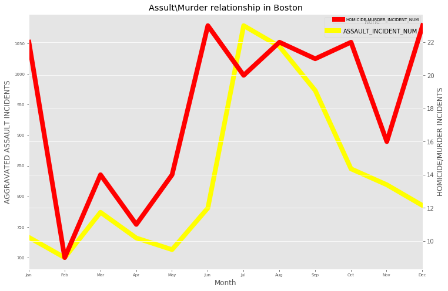

11. Conclude that:
From the plot we can see that Assualt and Homicide/Murder overlap to some extend. There could be possiblity that some of the Aggravted assult might turn out into Homicide/Murder.

# Overall Conclusion:
We can see that crime happen almost every part of Boston but top five affected districts are B2, D4, C11, A1 and B3. Aggraveted Assult and Murder/Homicide incidences are more prominent in said Boston District than its periphery.

When analyze Aggraveted assult and Homicide/Murder we can see some pattern. Some of the Aggravted assult might turn out into Homicide/Murder post the demise of the victim which result to series of other charges being framed against the accuse like murder, Homicide, intend to murder etc.

Also, most of such incidents happened between June till mid Sep during time when people are mostly active outdoor and enjoying the warm wheather compared to end of fall and winter season. 

# Analysis 3: Police Patrolling/Stops and Crime Analysis in Boston

1. I wanted to check if there is any relationship between crime incidents and police patrolling and their stops/barricading.
2. I wanted to check how it could affect any crime pattern in affected areas.
3. Since I had only crime database, I could not deduce any relation between crime pattern and police patrolling/stops.
4. I found the Boston gov website https://data.cityofboston.gov/ host similar database- Boston Police Department FIO.

Definition: Boston police department FIO program is a stop and frisk program. FIO’s document details when an individual is stopped and frisked for a potential threat, a suspect or gang member.

5. I collected FIO dataset through API in json format as raw data and put them in 'data' folder. I dump the json files together and created a csv file in 'processedData' folder. I used csv file for my further analysis.

Note: I've created seperate codes in same python file which was used to collect and store intital crime datasets. 

6. Call data from both Crime and FIO database and start analysing the relationship between them

7. I want to analyze the relation between the FIO numbers and Crime incidents by District. For this I have consolidated crime and FIO number over 12 districts and check the pattern.

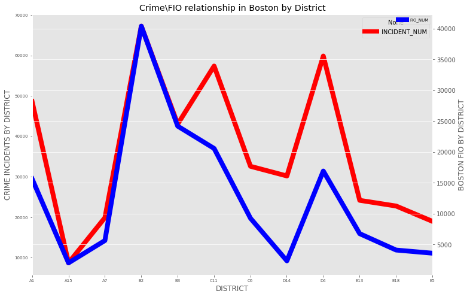

8. From above plot, it can be deduce that FIO is most frequent in those districts which are most crime affected

9. Further, I want to check if FIO increases how it affects the crime. For this I have consolidated crime and FIO number over month and check the pattern.

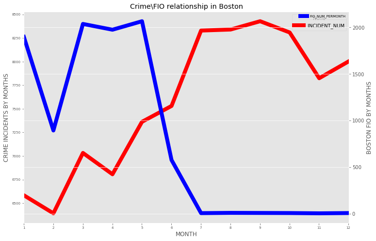

10. From above graph we can conclude that FIO is inversely proprotional to the Crime numbers. When FIO number is more crime is less and vice-versa.

11. I thought to check if any particular crime such as Auto Theft is affected with FIO in any district. 
12. For this analayis, I taken up the top four district where FIOs were most and checked if Auto Theft crime is reduce with FIO number or not.

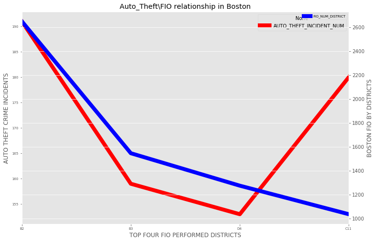

# Overall Conclusion:
For above plots, we can deduce that FIO is performed in region which is more affected by crime. Also, we analyze the relation between FIO and Crime over month it can be conclude that when FIO is performed most the crime reduces substantially. However, when we focused on a particular crime such as Auto Theft across top four districts where FIOs were most, the Auto Theft crime seems to reduce but no strong conclusive evidence can be make out of it.

# ADDITIONAL INSTRUCTIONS TO RUN THE CODE:

1. I have added the basemap library which is an extension of matplotlib library to plot the data over geographical location of any part of the world based on Logitude and Latitude cordinates.

2. I have created seprate environment for this so that its installation does not interfer the existing conda environment. Open the terminal and copy the below code:

visualization_eq$ conda create -n eq_env python=3 matplotlib basemap pillow

3. To activate the envirnment copy below code:
source activate eq_env

4. In order to successfully import the basemap Install jupyter notebook on this environment as the earlier existing jupyter notebook would have installed on the default environment. 

Note: If any analysis on this environment requires supporting libraries to be installed, activate the enironment and installed the the library. 

Citation & Reference:
https://matplotlib.org/basemap/users/examples.html
http://introtopython.org/visualization_earthquakes.html